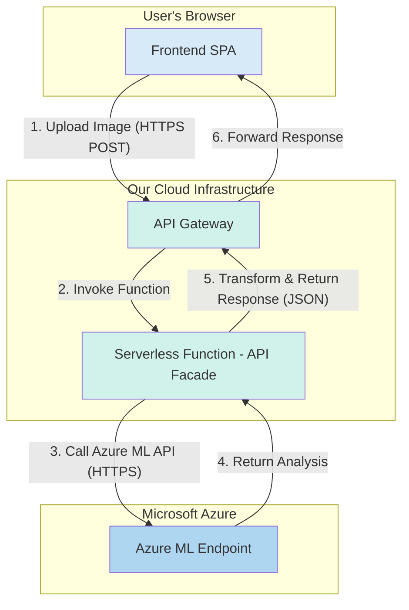

# Technical Architecture: Image Emotion Detection Service

## 1. Overview

This document outlines the technical architecture for the Image Emotion Detection web application. The architecture is designed to meet the product requirements for a simple, single-page application (SPA) that provides high-accuracy emotion analysis of user-uploaded images.

The system is composed of two main components:
1.  **Frontend:** A static web client responsible for the user interface, image upload, and results display.
2.  **Backend:** A server-side application that exposes an API endpoint to receive images, process them using a machine learning model, and return the emotion analysis results.

## 2. System Architecture Diagram (C4 Model - Component Level)



## 3. Technology Stack

This stack is chosen to prioritize development speed, scalability, and alignment with modern cloud-native practices.

| Component | Technology | Justification |
| :--- | :--- | :--- |
| **Frontend** | Vanilla JavaScript | A lightweight approach using native browser APIs, avoiding framework overhead for a simple user interface. |
| **Backend** | Node.js & Express | A popular and efficient JavaScript runtime, suitable for creating a simple, non-blocking API server to handle image uploads and proxy requests. |
| **ML Model** | **External Azure ML Endpoint** | The core emotion detection is handled by a pre-existing, high-accuracy Azure ML endpoint. Our backend's role is to act as a secure proxy to this service. This fulfills requirement **BE-2**. |
| **Infrastructure**| Serverless Functions (e.g., AWS Lambda) | A serverless approach is ideal for an API facade. It is highly cost-effective, scalable, and eliminates server management overhead. The function will handle the base64 encoding and the external API call. |
| **API Gateway** | AWS API Gateway (or equivalent) | Provides a secure, managed entry point for our API, handling request routing, throttling, and security. |

## 4. Data Flow

1.  **Image Upload:** The user selects an image via the vanilla JavaScript frontend. The client sends a `POST` request with `multipart/form-data` to our backend server endpoint (**BE-1**).
2.  **Backend Processing:** The Node.js server, using the Express framework, receives the request.
3.  **Data Transformation:** The function receives the image, converts it to a base64-encoded string, and constructs a JSON payload.
4.  **External API Call:** The function sends a `POST` request to the Azure ML endpoint, including the API key in the `Authorization` header.
5.  **Response Handling:** The function receives the JSON response from the Azure ML service. It then transforms this response into the format required by the frontend (**BE-4**).
6.  **Display Results:** The frontend receives the final JSON and renders the emotion labels and confidence scores (**FE-3**, **FE-4**).

## 5. API Specification

### 5.1. Frontend to Backend API (Our Service)

This is the API our frontend will call.

*   **Endpoint:** `/analyze`
*   **Method:** `POST`
*   **Request Body:** `multipart/form-data` with a single field named `image`.
*   **Success Response (200 OK):**
    *   **Content-Type:** `application/json`
    *   **Body (Example):**
        ```json
        {
          "emotions": [
            {"label": "neutral", "score": 0.60},
            {"label": "happiness", "score": 0.27},
            {"label": "surprise", "score": 0.08}
          ]
        }
        ```

### 5.2. Backend to Azure ML API (External Service)

This is the API our backend will call.

*   **Endpoint:** `https://emo-endpt-be5265.australiaeast.inference.ml.azure.com/score`
*   **Method:** `POST`
*   **Headers:**
    *   `Content-Type: application/json`
    *   `Authorization: Bearer <AZURE_ML_API_KEY>`
*   **Request Body:**
    ```json
    {"image_base64": "<base64_encoded_image_string>"}
    ```
*   **Success Response (200 OK):**
    *   **Body (Raw from Azure):**
        ```json
        {
          "label": "neutral",
          "confidence": 0.5959,
          "confidences": {
            "anger": 0.0113,
            "contempt": 0.0001,
            "disgust": 0.0000,
            "fear": 0.0042,
            "happiness": 0.2691,
            "neutral": 0.5959,
            "sadness": 0.0370,
            "surprise": 0.0820
          }
        }
        ```

## 6. Security & Configuration

*   **API Key Management:** The Azure ML API key is highly sensitive and **MUST NOT** be exposed to the frontend. It will be stored as a secure environment variable in the serverless function configuration.
*   **CORS:** The API Gateway will be configured with a restrictive CORS policy to only allow requests from the domain of our web application.

## 7. Data Privacy & Handling

As per **NFR-1**, data privacy is a key consideration.
*   **Data in Transit:** All communication is encrypted using HTTPS, both from the user to our backend, and from our backend to the Azure ML endpoint.
*   **Data at Rest:** User-uploaded images will be processed entirely in memory. **No images or analysis results will be stored on disk or in any database.**
*   **Data Lifecycle:** The image data exists only for the duration of the function's execution and is discarded immediately after the response is sent. This aligns with the stateless nature of the architecture.

This stateless, in-memory processing approach ensures maximum user privacy and minimizes data liability.